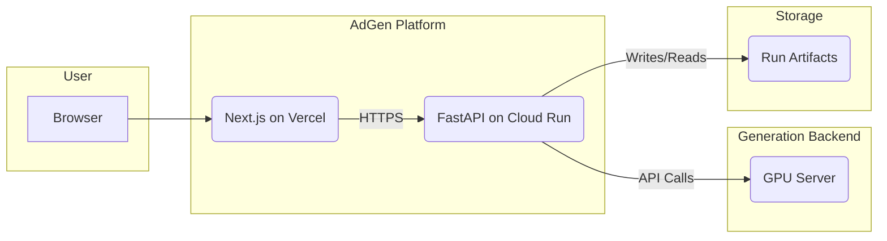

# AdGen System Architecture

This document provides a high-level overview of the AdGen system architecture, its components, and how they interact.

## 1. System Overview

The AdGen platform is designed as a decoupled, cloud-native application with three main parts:

1.  **Backend API (`adgen-api`)**: A Python FastAPI application responsible for orchestrating ad generation jobs.
2.  **Frontend UI (`adgen-frontend`)**: A Next.js single-page application that provides a user interface for creating and managing ad runs.
3.  **Generation Engine (ComfyUI)**: An external, GPU-powered service that takes a workflow graph and a prompt and produces the actual image or video assets.

The system is designed to be stateless where possible, with run artifacts and metadata persisted to a shared volume or cloud storage.

## 2. Component Interaction Flow

The diagram below illustrates the primary interaction flow:

**Detailed Workflow:**

1.  **User Interaction**: A user accesses the **AdGen Frontend** in their browser.
2.  **Create Run**: The user submits a new ad generation request (prompt, negative prompt, etc.) through the UI.
3.  **API Request**: The frontend sends a `POST /generate` request to the **Backend API**.
4.  **Orchestration**:
    *   The API creates a new run, assigns a `run_id`, and stores initial metadata.
    *   It patches a predefined ComfyUI workflow graph with the user's prompt.
    *   It submits this patched graph to the **ComfyUI** server.
5.  **Polling**: The frontend periodically polls the `GET /runs/{run_id}` endpoint on the Backend API to get status updates.
6.  **Image Generation**: ComfyUI processes the job and saves the output images to its own storage.
7.  **Finalization**: Once the user (or an automated process) triggers it, the frontend sends a `POST /finalize/{run_id}` request.
8.  **Artifact Collection**: The Backend API retrieves the image data from ComfyUI's output directory, saves it to the run's artifact storage, and packages everything into a ZIP file.
9.  **Download**: The user can then download the final ZIP archive through the frontend, which calls the `GET /download/{run_id}` endpoint.

## 3. API Patterns

*   **Asynchronous Operations**: Image generation is a long-running task. The API handles this asynchronously. A request to `/generate` immediately returns a `run_id` and a `PENDING` status, allowing the client to track the job without waiting for it to complete.
*   **Statelessness**: The API is designed to be stateless. All information about a run is stored in its corresponding directory (`meta.json`, artifacts). This allows the API to be scaled horizontally without needing a shared database for run state.
*   **RESTful Principles**: The API follows RESTful principles, using standard HTTP methods (`GET`, `POST`, `DELETE`) and status codes to represent operations and their outcomes.
*   **Environment-Driven Configuration**: All external dependencies and operational parameters (like the ComfyUI URL, runs directory, and port) are configured via environment variables, adhering to 12-Factor App principles.

## 4. Test Mode

For CI/CD and development without a GPU dependency, the orchestrator includes a **Test Mode**, enabled by setting `COMFY_MODE=test`. In this mode:

*   Actual HTTP calls to ComfyUI are mocked.
*   The API simulates a successful generation, creating fake image data and a ZIP file.
*   This allows for end-to-end testing of the API's orchestration logic, run management, and file handling without incurring GPU costs or setup overhead.

This architecture ensures a scalable, maintainable, and testable system for AI-powered ad generation.
